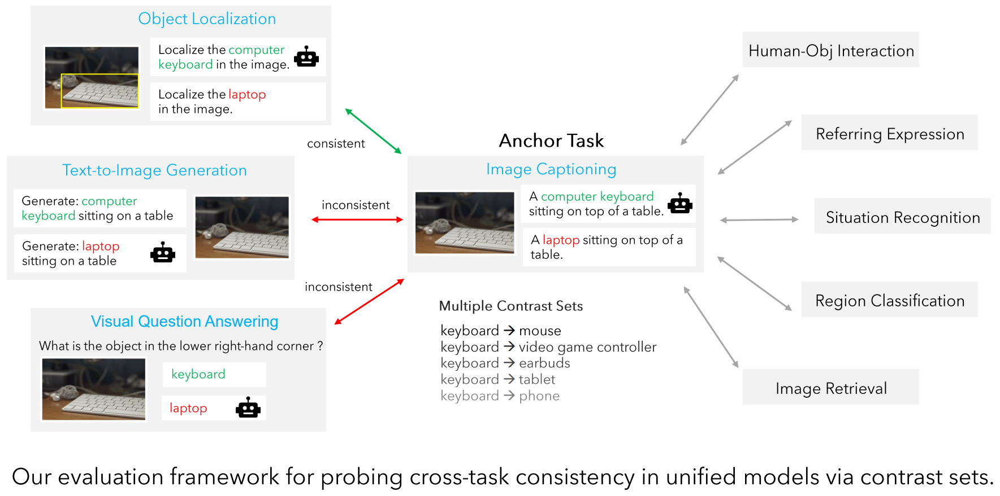
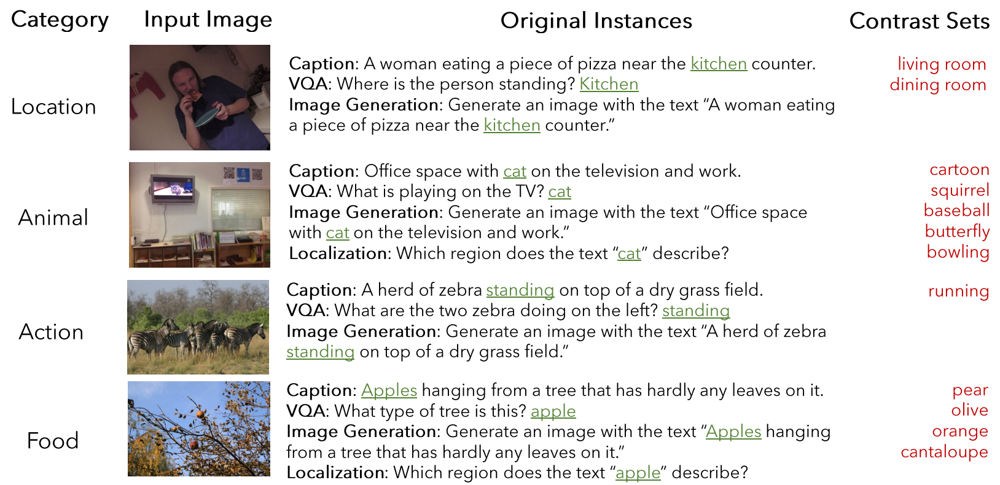

## Exposing and Addressing Cross-Task Inconsistency in Unified Vision-Language Models



### CoCoCON Dataset
We provide the CoCoCON evaluation dataset consisting of 1500 samples at ```./data/cococon.json```. Each sample contains 1-5 contrast sets. See paper for details and a few examples below.


#### Inference using Unified-IO Models
We evaluate the pretrained checkpoints provided [here](https://github.com/allenai/unified-io-inference) on CoCoCON.

1. Migrate to the directory ```unified-io```, follow instructions in the [original repository](https://github.com/allenai/unified-io-inference) to create JAX environment.
```cd unified-io```<br>
2. Download pretrained Unified-IO checkpoints and save in the directory ```./checkpoints/```.
3. To run likelihood-based evaluation of cross-task consistency using CoCoCON, execute the following command. Sizes can be chosen from ```small```, ```base```, ```large``` and ```xl```. Output files are saved at ```./results/``` by default. The path to validation split (val2014) of MS-COCO images is needed as additional input. \
```bash evaluate_cococon.sh <size> <path-to-image-directory>```<br>
3. To generate predictions for the samples in CoCoCON, execute the following command:
```bash evaluate_tasks.sh <size> <path-to-image-directory>```<br>
4. Follow instructions [here](#evaluation-of-coco-tasks) for evaluation of task-specific accuracies using output from Step 3.

#### Training and Inference using OFA Models
We first finetune pretrained checkpoints of OFA models on the four tasks in CoCoCON and then evaluate them on CoCoCON. Instructions for training OFA models coming soon!

#### Evaluation of COCO Tasks

### Acknowledgements
We thank the researchers behind [Unified-IO](https://github.com/allenai/unified-io-inference) and [OFA](https://github.com/OFA-Sys/OFA models) for making their models available for training and inference.
